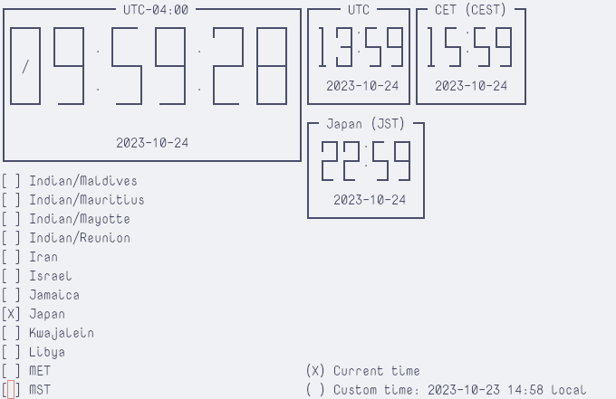

# world-wall-clock

**world-wall-clock** is a TUI application that provides a multi-timezone
graphical clock in a terminal environment.



## Installing world-wall-clock

You can install world-wall-clock with the Python packaging tool
[pip](https://pip.pypa.io/en/stable/). It is recommended to do so in a
[virtual environment](https://docs.python.org/3/library/venv.html).
Alternatively, you can use [pipx](https://pypa.github.io/pipx/) as a wrapper
around pip that will handle setting up a virtual environment for you.

### From PyPI, using pipx

```sh
pipx install world-wall-clock
```

### From PyPI, using pip in a virtual enviornment

```sh
python -m pip install world-wall-clock
```

### From the top level of the source repo, using pip in a virtual environment

```sh
python -m pip install .
```

## Running world-wall-clock

In an environment with world-wall-clock installed, start it from the command
line with:

```sh
wwclock
```

or

```sh
python -m world_wall_clock
```

## Usage

world-wall-clock is a graphical application. By default it shows a live view of
one local clock (the system time) and clocks for several time zones scattered
around the world. By navigating using arrow keys and selecting or deselecting
items from the sidebar of available timezones using the `Enter` or `Space` key,
you can customize the list of displayed clocks. This is silently stored in the
application configuration directory for the next time you launch
world-wall-clock.

Using the "Custom time" radio button, you can switch the application into custom
time mode. Edit the custom time to display by navigating to the numerical
datetime fields next to the custom time button and typing over their current
values (these are edited in "replace" rather than "insert" mode). The reference
timezone for the custom time can be changed by navigating up or down from the
timezone listed at the end of the custom time fields; the list of timezones
you can pick from here is populated from the timezones of your displayed clocks.

## Dependencies

world-wall-clock is a Python 3 application that relies on
[urwid](https://urwid.org/) as its terminal widget toolkit,
[xdg-base-dirs](https://github.com/srstevenson/xdg-base-dirs) to determine where
to keep the application configuration, and
[tzdata](https://github.com/python/tzdata) to provide backup timezone
information if this is not already present on the system.

## Development

world-wall-clock uses [Poetry](https://python-poetry.org/) to manage builds and
dependencies. The Python code is formatted using
[Black](https://github.com/psf/black).

With Poetry installed, set up a Poetry environment with all of
world-wall-clock's runtime and dev dependencies; from the top level of the
source repo, run:

```sh
poetry install
```

Now you can modify the source code and run the application with any changes
you've made using the `poetry run` command:

```sh
poetry run wwclock
```

The `poetry run` command will also allow you to run the suite of chosen dev
tools for static type-checking, import sorting, code formatting, and linting:

```sh
poetry run mypy --strict
poetry run isort .
poetry run black .
poetry run flake8
```
